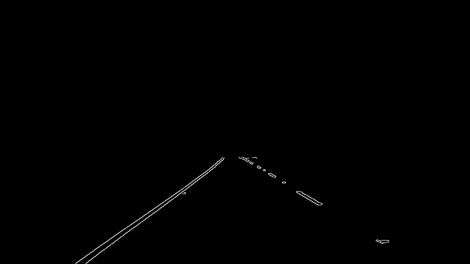

# **Finding Lane Lines on the Road** 

---

**Finding Lane Lines on the Road**

The goals / steps of this project are the following:
* Make a pipeline that finds lane lines on the road
* Reflect on your work in a written report

---

### Reflection

### 1. Pipeline

My pipeline consists of the following steps. 

1. Receive the original image (as a parameter or read from file)  

2. Blur the image using Gaussian blur. This step is required for better quality of Canny edge detector used in the next step.   

3. Detect edges on the image using Canny edge detector.  

4. Delete part of the image that we are not interested in (sky and roadside). 
Region that we select:  After cropping: 

5. \*Delete the region between the lanes.  
In the optional challenge car's hood is located here. Also shadows of trees fall into these region, so we are not interested in detecting lanes here. I added this step specially for optional challenge, it improved robustness of the algorthim on the last video. First two videos are processed successfully without this step. 
Notice: in steps 4 and 5 instead of hardcoding regions of interest in pixels, I define them relative to image dimensions. This allowed me to adopt my algorithms to the third video test case.
Region that we delete:  After deleting: 

6. Detect lane segments using Hough transform.  

7. Draw single lane on the left and right lanes. In order to do this, I modified the draw_lines() function by:
   * Filtering out line segments with slope less than 0.5 (these segments are too horizontal to part of lanes, which we are interested in)      
   * Separating line segments by their location. This is required to find which segments belong to the left lane and which to the right.  
   * Averaging segments of each lane. For each group of segments from step II we search for the least-squares solution for the line, which goes through all end points of segments belonging to the specified lane.      
   * Extrapolating found lane position. Using found coefficients m and c (y = m*x + c) we draw each lane starting from the bottom of the image till the top of region of interest.  

8. Finally we draw found lanes on the original image.

### 2. Identify potential shortcomings with your current pipeline

One potential shortcoming would be what would happen when car will be located not between the lanes. Currently my algorithm is tuned to detect the lanes only when the car is going between them. 
Another shortcoming could be possible obstacles: another car going in front of us, road works, animals or anything than can occlude lanes.
To my mind, one more interesting issue is when there are no lanes at all. I'm wondering if the algorithm should clearly determine this case.
Also if asphalt is not smooth, for example it contains patches (Russia is the case :), joints of patches could be determined as lanes by Hough transform.

### 3. Suggest possible improvements to your pipeline

A possible improvement would be to tune bluring on the first stage. Images from the optional challene appear to contain to many details after Canny edge detection. But I'm not sure how to apply blur adaptively, depending on some features of incoming image.

Actually, as mentioned in section 2, there are a lot of cases, which are not currently supported by the algorithm. Different computer vision tricks could be utilized for solving those cases one after another.

But as I see, the main thing is to generalize the algorithm as much as possible. And for this case deep learning might be suitable.

Thank you!
